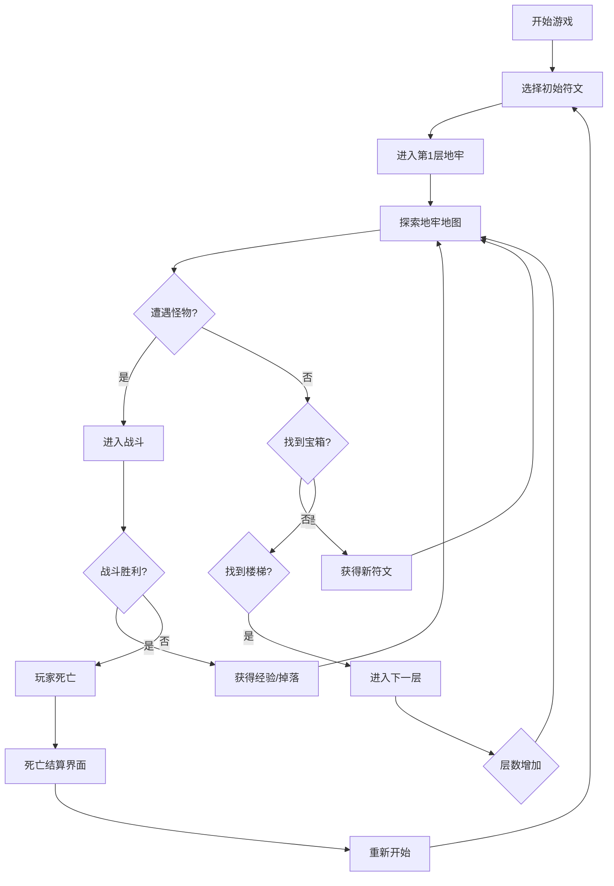

## 1. 产品概述

一款像素风格的Roguelike地牢冒险游戏，玩家扮演一只会魔法的小狐狸，在随机生成的地牢中探索、战斗、收集符文并组合出独特的魔法技能。每次冒险死亡后需重新开始，但通过不同的符文组合可以体验完全不同的战斗流派。

- 核心玩法：符文组合技能系统 + 随机地牢探索
- 目标用户：喜欢Roguelike、像素风、策略搭配的休闲玩家
- 产品价值：每次游玩都有新鲜感，符文组合带来的策略深度

## 2. 核心特性

### 2.1 核心玩法模块

1. **主菜单界面**：开始游戏、游戏说明、符文图鉴
2. **地牢探索场景**：随机生成地图、玩家移动、怪物遭遇
3. **战斗系统**：技能释放、怪物AI、伤害计算
4. **符文系统**：符文收集、符文组合、技能生成
5. **关卡推进**：宝箱奖励、层级深入、Boss战
6. **死亡结算**：本局回顾、重新开始

### 2.2 功能模块详情

| 页面/场景 | 模块名称 | 功能描述 |
|-----------|----------|----------|
| 主菜单 | 标题展示 | 像素风游戏Logo、动画小狐狸 |
| 主菜单 | 开始按钮 | 进入游戏、选择初始符文 |
| 主菜单 | 符文图鉴 | 展示已收集过的符文和技能组合 |
| 地牢场景 | 地图渲染 | 像素风地牢、迷雾探索、墙体/地面 |
| 地牢场景 | 玩家控制 | WASD/方向键移动、空格键释放技能 |
| 地牢场景 | 怪物系统 | 随机怪物生成、怪物AI巡逻/追击 |
| 战斗系统 | 技能释放 | 根据符文组合释放不同技能 |
| 战斗系统 | 伤害计算 | 元素克制、伤害数字飘字 |
| 符文系统 | 符文背包 | 最多4个符文槽位、拖拽组合 |
| 符文系统 | 技能生成 | 元素符文 + 效果符文 = 新技能 |
| 符文系统 | 元素类型 | 火、冰、雷三种基础元素 |
| 符文系统 | 效果类型 | 扩散、时间、强化、穿透等效果 |
| 宝箱系统 | 奖励掉落 | 击败怪物/开启宝箱获得新符文 |
| 关卡系统 | 层级推进 | 每层随机生成、找到楼梯进入下一层 |
| 死亡结算 | 本局数据 | 击杀数、到达层数、获得符文 |
| 死亡结算 | 重新开始 | 一键重开、随机初始符文 |

## 3. 核心流程

**核心玩法描述：**
1. 玩家从随机提供的符文中选择2-3个初始符文
2. 进入随机生成的地牢，使用WASD或方向键控制小狐狸移动
3. 遭遇怪物时自动进入战斗，玩家使用空格键或数字键释放组合好的技能
4. 地牢中散布着宝箱，开启可获得新符文
5. 找到通往下一层的楼梯继续深入
6. 玩家血量归零则游戏结束，显示本局成绩
7. 重新开始后获得全新的随机符文组合

## 4. 用户界面设计

### 4.1 设计风格

- **像素风格**：16x16像素贴图，复古游戏美学
- **主色调**：深紫色地牢背景 + 暖橙色火把光效 + 彩色符文光晕
- **辅助色**：火焰红、冰霜蓝、雷电黄、自然绿
- **字体**：像素风等宽字体，增强复古感
- **布局**：游戏画面居中，UI元素围绕边缘排列
- **动画**：帧动画角色、粒子特效、屏幕震动

### 4.2 界面设计概览

| 场景/页面 | 模块名称 | UI元素 |
|-----------|----------|--------|
| 主菜单 | 标题区 | 像素艺术Logo、小狐狸立绘、飘动的粒子 |
| 主菜单 | 按钮区 | 开始游戏、游戏说明、符文图鉴（像素风按钮） |
| 游戏场景 | 游戏画布 | 居中的地牢地图，像素渲染 |
| 游戏场景 | 顶部UI | 血量条、当前层数、金币数 |
| 游戏场景 | 底部UI | 符文槽位（4个）、技能图标、技能说明 |
| 游戏场景 | 符文组合区 | 两个组合槽 + 生成的技能预览 |
| 战斗界面 | 伤害数字 | 飘字效果、暴击特效 |
| 战斗界面 | 技能特效 | 像素粒子动画（火焰/冰霜/雷电） |
| 死亡界面 | 结算面板 | 像素边框面板、统计数据、重试按钮 |
| 符文图鉴 | 图鉴列表 | 网格布局、符文图标、解锁状态 |

### 4.3 响应式设计

- 桌面端为主设计，全屏游戏体验
- 游戏画布保持固定像素比例，自适应缩放
- 移动端可用虚拟摇杆，但以桌面端为优先

### 4.4 像素美术风格指导

- **小狐狸主角**：橙色皮毛，白色腹部，大尾巴，戴着巫师帽
- **地牢环境**：石砖地面、土墙、火把、骷髅装饰
- **怪物设计**：史莱姆、蝙蝠、骷髅兵、幽灵等经典像素怪物
- **符文设计**：六边形宝石造型，不同元素有不同颜色和纹路
- **技能特效**：像素粒子系统，每种元素有独特的动效

## 5. 符文技能系统

### 5.1 元素符文

| 符文名称 | 元素类型 | 基础效果 |
|----------|----------|----------|
| 火焰符文 | 火 | 造成灼烧伤害，有几率点燃 |
| 冰霜符文 | 冰 | 造成减速效果，有几率冻结 |
| 雷电符文 | 雷 | 造成高伤害，有几率麻痹 |

### 5.2 效果符文

| 符文名称 | 效果类型 | 效果描述 |
|----------|----------|----------|
| 扩散符文 | 扩散 | 技能范围扩大，攻击多个目标 |
| 时间符文 | 时间 | 技能持续时间延长/冷却缩短 |
| 强化符文 | 强化 | 技能伤害大幅提升 |
| 穿透符文 | 穿透 | 技能可穿透敌人/墙壁 |

### 5.3 组合技能示例

| 元素符文 | 效果符文 | 组合技能 | 技能效果 |
|----------|----------|----------|----------|
| 火焰 | 扩散 | 烈焰风暴 | 范围火焰爆炸，点燃区域内所有敌人 |
| 火焰 | 时间 | 炎爆持续 | 留下燃烧地面，持续造成伤害 |
| 火焰 | 强化 | 陨石坠落 | 召唤一颗巨型火球，超高单体伤害 |
| 冰霜 | 扩散 | 寒冰新星 | 全屏冰冻，所有敌人减速/冻结 |
| 冰霜 | 时间 | 绝对零度 | 冻结时间延长，冰冻期间受伤增加 |
| 冰霜 | 强化 | 冰锥穿刺 | 巨型冰锥，高伤害有几率即死 |
| 雷电 | 扩散 | 连锁闪电 | 闪电在敌人之间跳跃，伤害递减 |
| 雷电 | 时间 | 雷暴天气 | 持续落雷，随机打击场上敌人 |
| 雷电 | 强化 | 神罚之雷 | 单体超高伤害雷击，必定暴击 |
| 雷电 | 穿透 | 穿透雷弧 | 直线穿透的雷电光束 |
