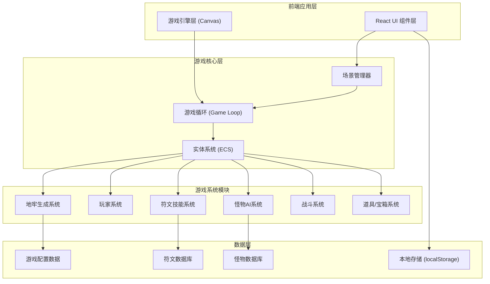

## 1. 架构设计



## 2. 技术选型

### 2.1 前端框架
- **React@18**：UI组件层，负责菜单、HUD、符文面板等界面
- **Vite**：构建工具，快速开发和热更新
- **TypeScript**：类型安全，提升代码可维护性
- **Tailwind CSS@3**：UI样式框架，快速构建像素风界面

### 2.2 游戏引擎
- **Canvas 2D API**：像素风游戏渲染，原生性能最优
- **自研轻量级游戏循环**：requestAnimationFrame驱动
- **实体组件系统 (ECS 简化版)**：游戏对象管理

### 2.3 状态管理
- **React Context + useReducer**：游戏UI状态
- **自定义 GameState 类**：游戏核心逻辑状态
- **localStorage**：符文图鉴、最高分持久化

### 2.4 像素美术
- **程序生成像素图形**：使用 Canvas 绘制像素角色和场景
- **粒子系统**：技能特效实现
- **帧动画**：角色行走、攻击动画

## 3. 目录结构

```
src/
├── components/          # React UI 组件
│   ├── MainMenu.tsx     # 主菜单
│   ├── GameHUD.tsx      # 游戏内HUD
│   ├── RunePanel.tsx    # 符文面板
│   ├── DeathScreen.tsx  # 死亡结算
│   └── RuneCodex.tsx    # 符文图鉴
├── game/                # 游戏核心逻辑
│   ├── GameEngine.ts    # 游戏引擎主类
│   ├── SceneManager.ts  # 场景管理器
│   ├── systems/         # 游戏系统
│   │   ├── DungeonGenerator.ts  # 地牢生成
│   │   ├── PlayerSystem.ts      # 玩家系统
│   │   ├── MonsterSystem.ts     # 怪物系统
│   │   ├── RuneSystem.ts        # 符文系统
│   │   ├── BattleSystem.ts      # 战斗系统
│   │   └── ParticleSystem.ts    # 粒子系统
│   ├── entities/        # 游戏实体
│   │   ├── Player.ts    # 玩家实体
│   │   ├── Monster.ts   # 怪物实体
│   │   ├── Chest.ts     # 宝箱实体
│   │   └── Projectile.ts # 弹道实体
│   └── utils/           # 工具函数
│       ├── math.ts      # 数学工具
│       ├── random.ts    # 随机数工具
│       └── pixel.ts     # 像素绘制工具
├── data/                # 游戏数据
│   ├── runes.ts         # 符文数据
│   ├── monsters.ts      # 怪物数据
│   └── config.ts        # 游戏配置
├── types/               # TypeScript 类型
│   ├── game.ts          # 游戏类型定义
│   ├── rune.ts          # 符文类型定义
│   └── entity.ts        # 实体类型定义
├── hooks/               # React Hooks
│   └── useGame.ts       # 游戏Hook
├── App.tsx              # 应用入口
├── main.tsx             # React 入口
└── index.css            # 全局样式
```

## 4. 核心类与模块定义

### 4.1 GameEngine 游戏引擎

```typescript
class GameEngine {
  canvas: HTMLCanvasElement;
  ctx: CanvasRenderingContext2D;
  sceneManager: SceneManager;
  keys: Set<string>;
  isRunning: boolean;
  
  start(): void;
  stop(): void;
  update(deltaTime: number): void;
  render(): void;
}
```

### 4.2 SceneManager 场景管理器

```typescript
class SceneManager {
  currentScene: Scene;
  
  changeScene(sceneName: string): void;
  getCurrentScene(): Scene;
}
```

### 4.3 RuneSystem 符文系统

```typescript
class RuneSystem {
  runeInventory: Rune[];  // 已收集的符文
  equippedRunes: Rune[];  // 装备的符文（最多4个）
  activeSkills: Skill[];  // 当前可用技能
  
  combineRunes(elementRune: Rune, effectRune: Rune): Skill;
  equipRune(rune: Rune, slot: number): void;
  addRune(rune: Rune): void;
}
```

### 4.4 DungeonGenerator 地牢生成器

```typescript
class DungeonGenerator {
  width: number;
  height: number;
  tiles: Tile[][];
  rooms: Room[];
  
  generate(level: number): Dungeon;
  generateRooms(): Room[];
  connectRooms(rooms: Room[]): void;
  placeMonsters(level: number): Monster[];
  placeChests(level: number): Chest[];
  placeStairs(): Position;
}
```

## 5. 核心数据流

### 5.1 游戏主循环
```
requestAnimationFrame 
  → 更新游戏状态
    → 玩家输入处理
    → 怪物AI更新
    → 碰撞检测
    → 技能/粒子更新
    → 血量/状态检查
  → 渲染画面
    → 地图瓦片渲染
    → 实体渲染
    → 粒子特效渲染
    → UI/HUD 渲染
```

### 5.2 符文组合流程
```
拖拽符文到组合槽
  → 验证组合有效性（元素+效果）
  → 查找/生成组合技能
  → 更新技能面板
  → 玩家释放技能
    → 播放技能动画
    → 计算伤害范围
    → 应用伤害/状态效果
    → 触发粒子特效
```

## 6. 游戏数据模型

### 6.1 符文数据模型

```typescript
interface Rune {
  id: string;
  name: string;
  type: 'element' | 'effect';
  element?: 'fire' | 'ice' | 'thunder';
  effect?: 'spread' | 'time' | 'power' | 'pierce';
  icon: string;      // 像素图标数据
  color: string;     // 主色调
  rarity: 'common' | 'rare' | 'epic';
  description: string;
}
```

### 6.2 技能数据模型

```typescript
interface Skill {
  id: string;
  name: string;
  elementRuneId: string;
  effectRuneId: string;
  damage: number;
  range: number;
  cooldown: number;
  duration: number;
  effect: SkillEffect;
  particleType: ParticleType;
  description: string;
}
```

### 6.3 怪物数据模型

```typescript
interface Monster {
  id: string;
  name: string;
  type: string;
  hp: number;
  maxHp: number;
  damage: number;
  speed: number;
  position: Position;
  aiType: 'passive' | 'aggressive' | 'patrol';
  sprite: PixelSprite;
  dropTable: DropItem[];
}
```

## 7. 性能优化策略

1. **瓦片地图优化**：只渲染可视区域内的瓦片
2. **对象池**：子弹、粒子等频繁创建销毁的对象使用对象池
3. **像素渲染**：使用 imageSmoothingEnabled = false 保持像素锐利
4. **状态分层**：UI层与游戏层分离渲染
5. **离屏Canvas**：静态瓦片预渲染到离屏画布

## 8. 本地存储

```typescript
interface SaveData {
  highestLevel: number;        // 最高到达层数
  totalKills: number;          // 总击杀数
  discoveredRunes: string[];   // 已发现的符文ID
  discoveredSkills: string[];  // 已发现的技能ID
  highScore: number;           // 最高分
}
```

存储键：`rune_fox_save`
